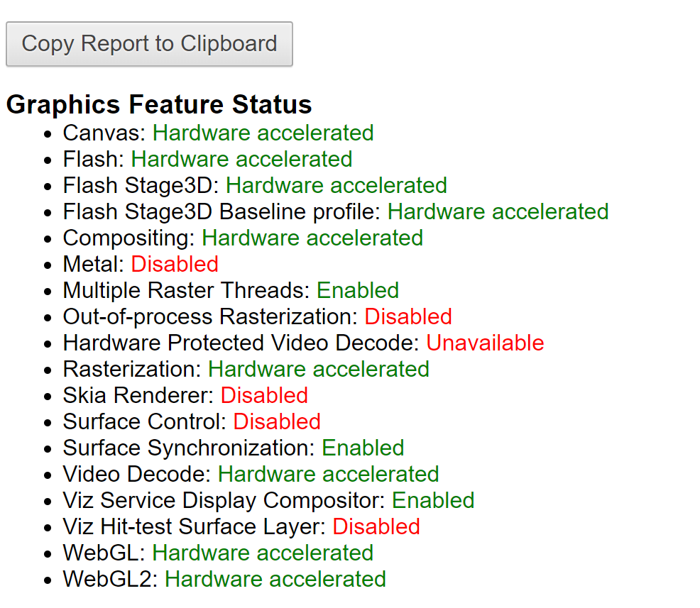
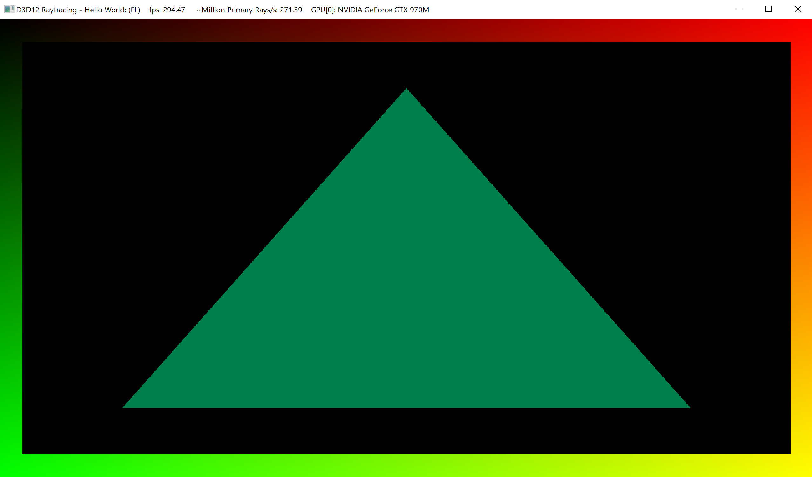
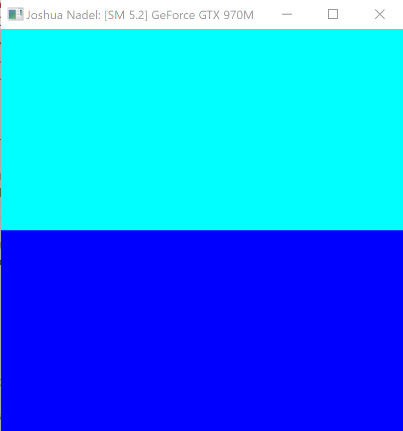
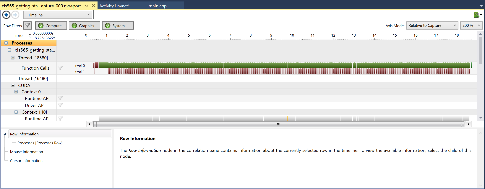
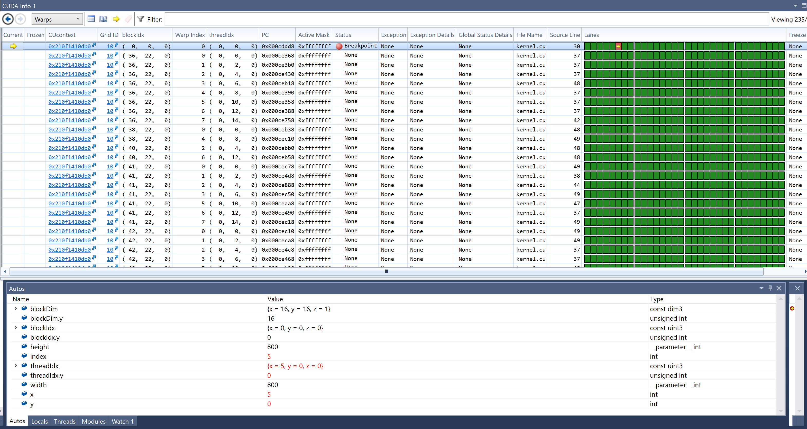

Project 0 Getting Started
====================

**University of Pennsylvania, CIS 565: GPU Programming and Architecture, Project 0**

* Joshua Nadel
  * [https://www.linkedin.com/in/joshua-nadel-379382136/](), [http://www.joshnadel.com/]()
* Tested on: Windows 10, i7-6700HQ @ 2.60GHz 16GB, GTX 970M (Personal laptop)

###

Compute Capability: 5.2

WebGL supported.

